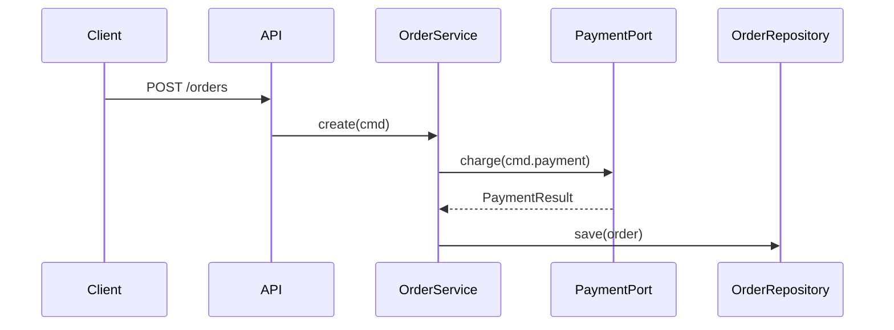

# SDD — Design Phase

Creates the technical design and architecture approach for a change. Triggered by the orchestrator when moving from proposal to implementation.

## Protocol

Follow **Section A** (skill loading) + **Section C** (persistence) from `skills/_shared/sdd-phase-common.md`.

**Do NOT launch sub-agents** — this is an EXECUTOR phase. Do the design work yourself.

## Input Artifacts (load in parallel)

- `sdd/{change-name}/proposal` — the approved change proposal
- `sdd/{change-name}/exploration` — (optional) exploration artifacts if a discovery phase ran
- Project standards from orchestrator (if injected)

## What to Produce

### 1. Architecture Decision

- Document the chosen architecture approach (Clean, Hexagonal, Screaming Layers, etc.)
- Define bounded contexts, modules, and dependency flow
- Choose: ports-and-adapters, event-driven, CQRS, or monolithic-with-modules
- Justify the choice against alternatives considered

### 2. Data Design

- Schema changes needed (if any)
- Migration strategy — backward compatible vs. breaking
- Data validation layers and boundaries

### 3. API Design

- Endpoints/APIs affected
- Request/response shape (OpenAPI-style or schema)
- Error handling conventions for the change

### 4. Security & Compliance

- Trust boundaries crossed
- Authentication/authorization changes needed
- Secrets/credentials handling
- Privacy impact (GDPR/CPPA) if data touched

### 5. Testing Strategy

- Unit test plan — key edge cases to cover
- Integration test plan — boundaries between services/modules
- Risk-based coverage of the 7 risk factors:
  1. Cross-context boundary (shared mutable state)
  2. File I/O, network I/O
  3. Async or concurrent execution
  4. Complex branching / cyclomatic >60
  5. Non-testable code (singletons, global state, private methods)
  6. Performance-critical paths (caching, N+1, loops)
  7. Error path / exception handling

## Actionable Examples (use as templates)

### 5.1 Design Document Template

```markdown
# Design: {Change Title}

## Context
{Link to proposal, exploration. One paragraph: why this design.}

## Architecture Decision
**Chosen**: {e.g., Hexagonal with ports-and-adapters}
**Alternatives considered**: {Clean, Modular monolith, Event-driven} — why rejected
**Dependency rule**: {e.g., domain → ports → adapters; no reverse}

## Module Map
| Module | Responsibility | Public API | Depends On |
|---|---|---|---|
| `domain/order` | Core order logic | `OrderService`, `OrderRepository` | — |
| `ports/payment` | Payment abstraction | `PaymentPort` | `domain/order` |
| `adapters/stripe` | Stripe implementation | `StripeAdapter` | `ports/payment` |

## Data Flow (Happy Path)


## Data Migration (if applicable)
| Phase | Strategy | Rollback |
|---|---|---|
| 1. Expand | Add new columns, dual-write | Drop columns |
| 2. Migrate | Backfill historical data | Revert backfill |
| 3. Contract | Remove old columns | Restore from backup |

## API Surface
| Endpoint | Method | Request | Response | Errors |
|---|---|---|---|---|
| `/orders` | POST | `CreateOrderReq` | `OrderRes` | 400, 402, 500 |

## Security Boundaries
- Trust boundary: `API` → `Domain` (validated DTOs only)
- Auth: JWT on API; domain receives `UserContext` (no tokens)
- Secrets: Stripe key in adapter only; never in domain

## Open Questions / Risks
- {Risk}: {Likelihood} — {Mitigation}
```

### 5.2 Architecture Decision Record (ADR) Template

```markdown
# ADR-{NNN}: {Title}

**Status**: {Proposed | Accepted | Superseded}
**Date**: {YYYY-MM-DD}
**Context**: {What forces us to decide?}
**Decision**: {What we chose}
**Consequences**:
- Positive: {benefits}
- Negative: {tradeoffs, costs}
- Neutral: {follow-up work}
**Alternatives**: {A: ..., B: ...} — why rejected
**Links**: proposal, design, related ADRs
```

### 5.3 Layering Pattern — Ports & Adapters (Hexagonal)

```text
src/
├── domain/           # Pure business logic, zero deps
│   ├── order.ts
│   └── ports/        # Interfaces (outbound)
│       └── PaymentPort.ts
├── application/      # Use cases, orchestrates domain
│   └── CreateOrderUseCase.ts
├── adapters/         # Implement ports (inbound/outbound)
│   ├── http/         # Inbound: Express/Fastify controllers
│   └── stripe/       # Outbound: StripePaymentAdapter.ts
└── config/           # Wiring: DI container, env
```

**Rule**: Domain imports nothing external. Adapters import domain. Application imports domain + ports.

### 5.4 API Design — Versioned, Typed, Documented

```typescript
// contracts/orders/v1/create-order.ts
export interface CreateOrderRequest {
  customerId: CustomerId;        // Branded type
  items: ReadonlyArray<OrderItem>;
  payment: PaymentMethod;        // Discriminated union
  idempotencyKey: IdempotencyKey;
}

export interface CreateOrderResponse {
  orderId: OrderId;
  status: 'created' | 'payment_pending';
  expiresAt: ISO8601;
}

export type CreateOrderError =
  | { code: 'VALIDATION_ERROR'; details: ValidationError[] }
  | { code: 'PAYMENT_DECLINED'; reason: string }
  | { code: 'IDEMPOTENCY_CONFLICT'; existingOrderId: OrderId };
```

### 5.5 Data Migration — Expand/Contract Pattern

```sql
-- Phase 1: Expand (backward compatible)
ALTER TABLE orders ADD COLUMN payment_intent_id VARCHAR(255);
CREATE INDEX idx_orders_payment_intent ON orders(payment_intent_id);

-- Phase 2: Migrate (dual-write in code, backfill script)
UPDATE orders SET payment_intent_id = pi.id
FROM payment_intents pi WHERE pi.order_id = orders.id;

-- Phase 3: Contract (after verification)
ALTER TABLE orders DROP COLUMN legacy_payment_ref;
```
---

## Reference Materials

The following material is externalized to keep this skill under the 3KB token budget (ADR-007).
Consult these when the skill needs detailed worked examples or guardrails:

- **Worked Examples, Testing Patterns, Edge Cases, Anti-Patterns, Quick Reference**
  → docs/skills/sdd-design/reference.md

---
