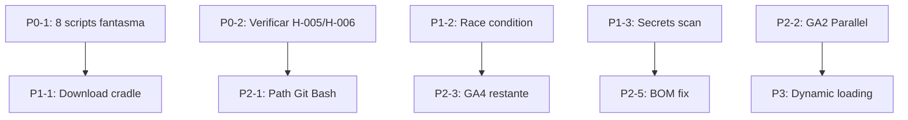

# Plan de Implementación — Auditoría Consolidada

> **Basado en**: 31 hallazgos únicos deduplicados (17 resueltos, 14 vigentes)
> **Estado**: Propuesta P0-P3 — pendiente de aprobación humana
> **Última revisión**: 2026-07-03

---

## Priorización

| Prioridad | Enfoque | Items | Esfuerzo |
|-----------|---------|-------|----------|
| **P0 - Inmediato** | Decisión + Verificación | H-003 (8 scripts), H-005, H-006 (verificar) | 1-2h |
| **P1 - Alta** | Seguridad + Bugs | H-001, H-004, H-009, H-015 | 3-5h |
| **P2 - Media** | Deuda técnica + Performance | H-007, H-011, H-017, H-019, H-030 | 4-6h |
| **P3 - Baja** | Housekeeping + Tokens | H-016, H-018, H-020-026, H-031 | 3-4h |

---

## P0 — Inmediato

### P0-1: Decidir destino de 8 scripts fantasmas (H-003)

**Problema**: 8 scripts referenciados en AGENTS.md y docs que no existen.
**Acción requerida**: Decisión de diseño (no código):
- Opción A: Crear stubs funcionales
- Opción B: Eliminar referencias de AGENTS.md y docs
- Opción C: Implementar según plan original
**Depende de**: Aprobación humana
**Archivos afectados**: AGENTS.md, cross-ref-check.ps1

### P0-2: Verificar H-005 y H-006 en código actual

**Problema**: backup.ps1 y optimize-system.ps1 no verificados en la última ronda (confianza 60%).
**Acción**: Leer ambos scripts, verificar estado actual de ErrorActionPreference y rollback.
**Depende de**: N/A — solo lectura

---

## P1 — Alta

### P1-1: Download cradle opcional (H-001)

**Archivo**: `scripts/install.ps1:46`
**Acción**: Agregar verificación SHA256 checksum antes de `Invoke-Expression` en el flujo opcional de gentle-ai CLI.
**Código sugerido**:
```powershell
$expectedHash = 'abc123...'  # SHA256 conocido
$actualHash = (Get-FileHash -Algorithm SHA256 -Path $tempFile).Hash
if ($actualHash -ne $expectedHash) { throw "Checksum mismatch" }
```
**Verificación**: Test-Path que el patrón `Invoke-Expression.*Invoke-WebRequest` no exista sin checksum.

### P1-2: Race condition inter-track.json (H-004)

**Archivo**: `scripts/inter-track.ps1:56,104`
**Acción**: Implementar file lock para JSON read-modify-write.
**Opción recomendada**: Usar `[System.IO.File]::Open($path, 'OpenOrCreate', 'ReadWrite', 'None')` para lock exclusivo durante write.

### P1-3: Secrets scan completo (H-009)

**Archivos**: `scripts/verify.ps1:48`, `scripts/score-auto.ps1:23`
**Acción**: 
1. Agregar regex para GH_TOKEN, ghp_, github_pat_, AKIA, claves SSH
2. Extender scan a scripts/, workflows/, config/
**Verificación**: gitleaks scan en pre-commit

### P1-4: Path traversal restore.ps1 (H-015)

**Archivo**: `scripts/restore.ps1:28,37`
**Acción**: Validar `$Revision` con regex `^[\w/\.-]+$`

---

## P2 — Media

### P2-1: Path Git Bash hardcodeado (H-007)

**Archivos**: `scripts/pull-upstream.ps1:71`, `scripts/check-upstream.ps1:71`
**Acción**: Reemplazar path fijo con `(Get-Command bash.exe).Source`
**Riesgo**: Bajo — cambio localizado

### P2-2: GA2 Parallel (H-011)

**Archivos**: skill-graph.ps1, score-auto.ps1, pssa-gate.ps1
**Acción**: Implementar `ForEach-Object -Parallel -ThrottleLimit 4`
**Speedup estimado**: 4-8x

### P2-3: GA4 .NET restantes (H-017)

**Archivos**: backup.ps1, restore.ps1
**Acción**: Aplicar StreamReader/EnumerateFiles donde manejen archivos grandes

### P2-4: Overweight check scope (H-019)

**Acción**: Extender karpathy-loop check a commands/ + prompts/
**Verificación**: Todos los archivos inyectados en prompts de subagentes <3KB

### P2-5: BOM estandarizado (H-030)

**Acción**: Ejecutar `scripts/pssa-gate.ps1 -Mode Fix`

---

## P3 — Baja

| Item | ID | Acción | Esfuerzo |
|------|----|--------|----------|
| GB1 TALE Budgets | H-020 | Agregar budgets a triggers de skills | 30 min |
| GB2 Compression Tree | H-021 | Documentar en context-watchdog | 15 min |
| GB3 Dynamic Loading | H-022 | Skill-graph + skill-digestion redesign | 2-4h |
| GB4 TOON Format | H-023 | Prompts en formato pipe | 1h |
| Parámetros 1 letra | H-016 | Renombrar en 11 scripts | 30 min |
| Comandos huérfanos SDD | H-018 | Crear stubs o eliminar refs | 15 min |
| git-fast.ps1 | H-024 | Decidir crear/eliminar | 15 min |
| .husky/pre-commit | H-025 | Decidir migración | 15 min |
| npx pinning | H-026 | Agregar @version a MCPs | 5 min |
| SDD duplicadas | H-031 | Decidir canonical | 15 min |

---

## Dependencias entre fases



> **Nota**: P0-1 y P0-2 no tienen dependencias técnicas — se pueden ejecutar en paralelo.
> P1 y P2 son independientes entre sí (se pueden paralelizar).
> P3 es secuencial pero no bloquea nada.

---

## Métricas Objetivo

| Métrica | Actual | Target | Responsable |
|---------|--------|--------|-------------|
| Scripts existentes con referencia en AGENTS.md | 8 missing | 0 missing | P0-1 |
| Download cradles sin checksum | 1 | 0 | P1-1 |
| Race conditions conocidas | 1 | 0 | P1-2 |
| Paths hardcodeados | 2 | 0 | P2-1 |
| Scripts sin -Parallel en hot paths | 3 | 0 | P2-2 |
| Skills con TALE budgets | 0/68 | 68/68 | P3-GB1 |
| Hallazgos 🔴 pendientes | 6 | 0 | Todo P0+P1 |
