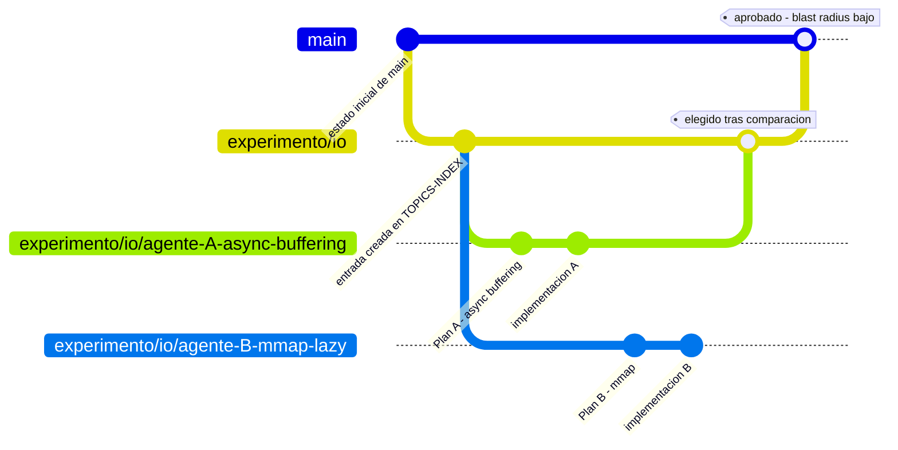
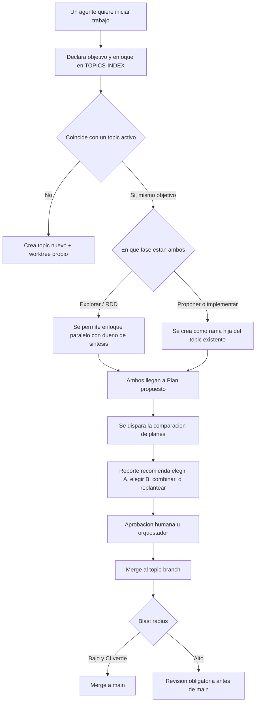

# Protocolo de Coordinación Multiagente por Ramas — v1

> **Estado:** aprobado por owner (2026-09-19) — enmiendas E1-E10 aplicadas
> **Se apoya en:** `agentic-code-workflows` — junto a `protocolo_mejora_autonoma_v3`, `orchestrator_arquitecto_2026` y `prompt_analisis_diamante`
> **Mapea directo a:** el ciclo SDD de 9 fases de `gentleman-agent-gh` (sección 5.8)
> **Fecha:** 2026-09-18 (enmiendas E1-E10: 2026-09-19)

## 1. Veredicto

**Sí, la idea central es sólida.** Aislar agentes con `git worktree` por rama, y comparar los resultados de dos agentes que atacan lo mismo en paralelo antes de elegir uno, son patrones que ya se usan en producción en 2026 (Warp, equipos de Claude Code y otros orquestadores lo hacen así).

Pero la formulación original mezcla dos problemas que necesitan mecanismos distintos:

1. **Aislamiento mecánico** — que dos agentes no se pisen los archivos mientras trabajan. Lo resuelve `git worktree`, no la rama por sí sola: una rama sin worktree dedicado sigue compartiendo el mismo directorio de trabajo.
2. **Arbitraje semántico** — que dos agentes no dupliquen el mismo objetivo sin saberlo, aunque tomen caminos distintos. Una convención de nombres no alcanza para esto: hace falta un registro que compare **objetivos y planes declarados**, no nombres de rama.

Este documento separa ambos problemas y propone una arquitectura para los dos. No reemplaza el loop interno de cada agente (tu patrón karpathy-loop sigue igual dentro de cada intento) — agrega una capa de coordinación *entre* ramas/agentes.

## 2. Diagnóstico de la propuesta original

Lo que ya está bien encaminado:
- Ramas externas por agente en vez de un directorio compartido — la dirección correcta.
- Comparar "Plan 1 vs Plan 2" en vez de fusionar por orden de llegada — el mismo patrón que ya usan orquestadores multiagente reales para este problema.
- Mantener historial completo por tema, tratándolo como sub-proyecto especializado — razonable.

Lo que hay que ajustar antes de implementar algo:
- El nombre de la rama no puede ser el único mecanismo de detección de solapamiento (sección 5.4).
- "Tomar el mejor plan" necesita un mecanismo explícito de quién arbitra y quién aprueba — si no, es una decisión automática sin dueño, lo cual choca con tu restricción de `zero-implementation-until-approval`.
- A escala de 2 agentes, la versión completa de este protocolo puede ser más aparato del que hace falta todavía — por eso la sección 8 propone empezar manual.

## 3. Terminología adoptada en este documento

No tenía una definición previa tuya de ODD/RDD. Para este documento, siguiendo el mismo patrón de nombrar que tu propio SDD (Spec-Driven Development), asumo:

- **RDD — Research-Driven Development:** ninguna propuesta pasa a `propose` sin investigación real antes (código existente, benchmarks previos, research externo si aplica). Vive dentro de la fase `explore`.
- **ODD — Objective-Driven Development:** la unidad de coordinación entre agentes es el **objetivo compartido**, no el nombre de rama ni el enfoque técnico. Dos ramas con nombres y enfoques distintos, pero el mismo objetivo declarado, son a efectos de este protocolo el mismo topic.

Si tenías otra definición en mente, esta sección es la que hay que corregir — el resto del documento depende de ODD en particular.

Nota: "orquestador" es el mismo rol que ya definiste en `orchestrator_arquitecto_2026` — puede ser vos mismo, u otro agente designado para ese rol.

## 4. Alternativas evaluadas por decisión clave

Nota de método: en vez de simular una transcripción de 10 subagentes, esta sección compara alternativas reales para cada decisión clave — misma rigurosidad, sin el relleno de un diálogo ficticio.

### 4.1 Mecanismo de aislamiento

| Opción | Ventaja | Riesgo/costo | Recomendación |
|---|---|---|---|
| Un solo directorio, cambiar de rama | Simple | Un agente pisa los archivos del otro sin que nadie se entere | Descartada |
 | Clon separado del repo por agente | Aislamiento total | Duplica `.git`; no comparte avances sin fetch/pull manual | Solo si además necesitás aislar entorno |
| **`git worktree` por rama** | Aislamiento real de archivos, comparte historial | Cada worktree es un checkout completo — cuidado en repos grandes (usar sparse-checkout) | **Base recomendada** |
| Contenedor/sandbox por agente | Aislamiento total, incluye entorno/puertos | Más infraestructura, más lento de levantar | Sumar sobre worktree solo si hace falta aislar entorno |

**Criterio de worktree (E10):** obligatorio solo cuando hay 2+ agentes activos en el mismo topic en fase `propose`+ o con `exploracion_paralela_intencional: true`. Si los scopes son disjuntos (sin posibilidad de colisión de archivos), worktree es opcional — fricción mínima, coherente con §7:270.

### 4.2 Detección de solapamiento

| Opción | Qué detecta | Dónde falla |
|---|---|---|
| Solo convención de nombres | Colisiones obvias (mismo slug) | Nombres distintos, mismo objetivo real |
| Coincidencia de tags/keywords | Algo más de recall | Sinónimos, vocabulario distinto para lo mismo |
| Similitud semántica sobre objetivo + plan declarado | La mayoría de solapamientos reales | Falsos positivos si el umbral es muy laxo |
| Solo revisión manual | Cero falsos positivos automáticos | No escala |

Recomendación: capas 1→2→3 en cascada, barato primero; revisión manual solo si el score cae en zona ambigua.

### 4.3 Arbitraje entre Plan A y Plan B

| Opción | Cuándo funciona | Riesgo |
|---|---|---|
| Automático por métrica (benchmark) | Criterio de éxito puramente cuantitativo | Ignora trade-offs cualitativos |
| LLM árbitro (tipo `prompt_analisis_diamante`) | Compara trade-offs cuali + cuanti en un reporte | Costo de tokens; sesgo posible hacia el estilo del propio modelo |
| Solo revisión humana | Máximo control | No escala con muchos topics en paralelo |
| **Híbrido: LLM recomienda, humano/orquestador aprueba** | Combina escala y control | Exige que el reporte compare de verdad, no resuma cada plan aparte |

Recomendación: híbrido — coherente con `zero-implementation-until-approval`.

### 4.4 Ciclo de vida de la rama de topic

| Opción | Historial | Complejidad |
|---|---|---|
| Rama de topic efímera, se borra al fusionar | Se pierde salvo por el log de main | Simple |
| **Persistente, archivada (no borrada) tras fusionar** | Completo, como pediste | Necesita convención de archivado |
| Cada intento se vuelve su propio topic si diverge mucho | Muy granular | Multiplica registros, riesgo de "roster rot" |

Recomendación: persistente + archivada, con tag en el merge a main.

## 5. Arquitectura propuesta

### 5.1 Modelo de ramas (dos niveles)

- `main` — integración final, siempre estable.
- `experimento/<slug-tema>` — larga duración, una por tema activo (tu "sub-proyecto especializado"). Se archiva, no se borra, al fusionar.
- `experimento/<slug-tema>/<agente-id>-<slug-enfoque>` — corta duración, una por intento de un agente dentro del tema. Vive en su propio `git worktree`. **Solo se crea cuando dos agentes colisionan en el mismo topic con fase `propose` o posterior.** En Fase 0 se usa solo el nivel plano `experimento/<slug>`.



Cada agente trabaja en su propio `git worktree` sobre su rama de intento — nunca comparten directorio de trabajo, aunque comparten `.git` e historial. Esto resuelve el aislamiento mecánico del veredicto (sección 1). **Nota:** el worktree es obligatorio solo bajo el criterio de la tabla de §4.1; en Fase 0 con scopes disjuntos es opcional.

### 5.2 Convención de nombres

```
experimento/<slug-tema>
experimento/<slug-tema>/<agente-id>-<slug-enfoque>
```

- `slug-tema`: kebab-case, 2-4 palabras, tomado de una lista controlada en `TOPICS-INDEX` (no texto libre) — evita casi-duplicados como `io`, `io-optimizacion`, `mejora-io` coexistiendo como temas distintos. Fundamento: historial real del repo ya usa `experimento/*` (rama actual `experimento/perfiles-zen-go`).
- `agente-id`: identificador estable del agente/rol, no necesariamente el nombre del modelo.
- `slug-enfoque`: 2-4 palabras describiendo el ángulo técnico específico.

El nivel hijo (`/<agente-id>-<slug-enfoque>`) solo se crea cuando dos agentes colisionan en el mismo topic con fase `propose` o posterior. En Fase 0 se usa solo el nivel plano.

Ejemplos: `experimento/perfiles-zen-go`, `experimento/io/agente-A-async-buffering`, `experimento/io/agente-B-mmap-lazy`.

### 5.3 Registro central de topics (`TOPICS-INDEX`)

Mismo rol que ya cumple `SKILLS-INDEX.md` en `gentleman-agent-gh`, aplicado a temas en curso en vez de skills.

Esquema por entrada (adaptado de un patrón de registro de investigación ya usado en coordinación multiagente — ver sección 10):

```yaml
- topic_id: experimento/io
  objetivo: "Reducir la latencia de I/O en el modulo de ingestion"
  fase: propuesto   # explorando | propuesto | en_comparacion | aprobado | fusionado | archivado
  creado: 2026-09-15
  actualizado: 2026-09-18
  exploracion_paralela_intencional: false
  bitacora:
    - "2026-09-15: fase explorando"
    - "2026-09-18: fase propuesto, arbitraje Plan A vs Plan B → recomendacion combinar"
  ramas:
    - rama: experimento/io/agente-A-async-buffering
      agente: agente-A
      hipotesis: "Reduce bloqueos de escritura sin cambiar el formato de archivo"
      evidencia_favor: ["benchmark local: -35% p95 en escritura"]
      evidencia_contra: []
      confianza: media
    - rama: experimento/io/agente-B-mmap-lazy
      agente: agente-B
      hipotesis: "Reduce copias de memoria en lectura secuencial grande"
      evidencia_favor: ["-RAM en pruebas con archivos >500MB"]
      evidencia_contra: ["no aplica bien a escritura concurrente"]
      confianza: media
  dueno_sintesis: orquestador   # dueño de sintesis/comparacion — ver 5.4
```

Reglas de escritura:
- Atómica, siempre — igual que ya exigís en tus otros protocolos. Nunca dos agentes escriben el registro al mismo tiempo sin lock.
- Regenerable, no solo mantenida a mano: un script que reconcilie `TOPICS-INDEX` contra `git branch --list 'experimento/*'` y marque entradas huérfanas o ramas sin entrada, para no repetir el mismo desfase que tu auditoría encontró entre `SKILLS-INDEX.md` y la implementación real.

### 5.4 Detección de solapamiento

El nombre de rama ayuda a un humano a escanear rápido, pero no alcanza: dos objetivos iguales pueden tener nombres distintos, y dos nombres iguales pueden esconder objetivos distintos.



Capas de detección, de más barata a más cara (cascada, subís de capa solo si la anterior no resuelve):
1. Coincidencia exacta/difusa de `slug-tema` contra `TOPICS-INDEX`.
2. Coincidencia de tags/keywords declarados.
3. Similitud semántica entre objetivo + plan declarado (no el nombre) — umbral orientativo ~55%, ajustable con la métrica de falsos positivos/negativos de la sección 5.7.

Si la fase es `explore`, el solapamiento no bloquea: se marca `exploracion_paralela_intencional: true` con un dueño de síntesis (ODD tolera divergencia de enfoque en esta fase). Si la fase es `propose` o posterior, el nuevo intento se crea como rama hija del topic existente, no como topic nuevo.

### 5.5 Comparación de planes (Plan A vs Plan B)

Plantilla obligatoria antes de `apply`, en cada rama de intento:

```markdown
## Plan — experimento/<slug>/<agente>-<enfoque>

- Objetivo compartido: (debe coincidir con el objetivo del topic en TOPICS-INDEX)
- Enfoque propuesto:
- Cambios previstos (archivos/modulos):
- Riesgos:
- Blast radius estimado: bajo / medio / alto
- Criterios de exito / pruebas (medibles):
- Dependencias o bloqueos:
```

Como ya establecés en tus otros protocolos, el `.md` manda sobre cualquier memoria de sesión: si un agente retoma un intento después de un reinicio de contexto, relee su Plan y la entrada de `TOPICS-INDEX` — no asume nada de una sesión anterior.

- **Disparador:** solapamiento confirmado + dos o más ramas del mismo topic llegan a `propose` con su Plan completo.
- **Quién compara:** un prompt de arbitraje dedicado — `prompt_analisis_diamante` es buen punto de partida, adaptado para recibir dos o más Planes y devolver un reporte comparativo (no un resumen de cada uno por separado).
- **Salida esperada:** fortalezas/debilidades relativas, riesgo relativo, y una recomendación entre: elegir A, elegir B, combinar, o rechazar ambos y replantear el objetivo.
- **Quién decide:** la recomendación nunca fusiona nada por sí sola — aprobación humana u orquestador, según la tabla de blast radius de la sección 5.6.

### 5.6 Validación pre-merge y blast radius

1. CI estándar, bloqueante (tests, build, lint) — si falla, no hay merge, sin importar el arbitraje.
2. Clasificación de blast radius (mismo concepto que ya usás en `orchestrator_arquitecto_2026`): bajo (módulo aislado), medio (toca interfaces compartidas con cobertura de tests), alto (toca rutas core/compartidas o sin cobertura).

| Blast radius | Merge intento → topic | Merge topic → main |
|---|---|---|
| Bajo | Automático si CI verde | Automático si CI verde |
| Medio | Automático si CI verde | Aprobación humana/orquestador |
| Alto | Aprobación humana/orquestador | Aprobación humana/orquestador, sin excepción |

### 5.7 Bitácoras, métricas y benchmarks

**Bitácora:** entradas fechadas en `TOPICS-INDEX` (trackeado) por topic — cada cambio de fase, intento creado/descartado y resultado del arbitraje. Los `05-implementacion-completada.md` siguen gitignored como artefactos runtime; la fuente de verdad es el registro.

**Métricas del protocolo:**
- Tiempo `explore → propose` y `propose → fusionado`, por topic.
- Solapamientos detectados vs. confirmados como reales (para calibrar el umbral: muchos falsos positivos → subilo; solapamientos que se escapan → bajalo).
- Resultado del arbitraje: % elegido A / % elegido B / % combinado / % rechazado.
- Duplicación no detectada a tiempo (se descubre en el merge o después) — tratarla como defecto de proceso, no como algo esperable.

**Benchmarks:** los criterios de éxito del Plan (5.5) deben ser medibles antes de implementar, no post-hoc. Correr el mismo benchmark, mismo dataset y entorno, sobre Plan A, Plan B y la combinación si aplica — comparar bajo condiciones distintas invalida el arbitraje.

### 5.8 Mapeo al ciclo SDD de `gentleman-agent-gh`

| Fase SDD | En este protocolo |
|---|---|
| `init` | Entrada nueva en `TOPICS-INDEX` + worktree + rama `experimento/<slug>` |
| `explore` | RDD: investigación real antes de proponer. Tolera exploración paralela con dueño de síntesis si el objetivo coincide |
| `propose` | Cada intento llena su Plan (5.5). Si hay solapamiento, ambos llegan aquí antes de compararse |
| `spec` | Se formaliza el plan elegido/combinado tras el arbitraje y la aprobación |
| `design` | Diseño técnico detallado del plan aprobado |
| `tasks` | Desglose en tareas ejecutables |
| `apply` | Implementación real, dentro del worktree del intento correspondiente |
| `verify` | CI + blast radius + aprobación humana si el radio es alto |
| `archive` | Merge a `experimento/<slug>` → merge a `main` → la rama de topic se archiva (no se borra), bitácora completa conservada |

## 6. Ejemplo end-to-end: el caso "IO"

1. **Agente A** arranca a investigar mejoras de I/O. Consulta `TOPICS-INDEX`: no hay topic activo para I/O. Crea `experimento/io`, abre worktree en `experimento/io/agente-A-async-buffering`, y declara el objetivo: *reducir la latencia de I/O en el módulo de ingestión*. Fase: `explore`.
2. **Agente B** recibe la misma instrucción general. Antes de crear rama, consulta `TOPICS-INDEX` y encuentra `experimento/io` con el mismo objetivo. Ambos siguen en `explore` → se permite exploración paralela (ODD), se marca `exploracion_paralela_intencional: true` y se asigna un dueño de síntesis (el orquestador). Agente B abre worktree en `experimento/io/agente-B-mmap-lazy`.
3. Ambos completan su investigación (RDD) y pasan a `propose`, llenando su Plan (5.5) en su propia rama.
4. Al llegar los dos a `propose` sobre el mismo topic, se dispara la comparación automáticamente (5.4/5.5).
5. El árbitro (prompt tipo `prompt_analisis_diamante`) devuelve: Plan A reduce mejor la latencia de escritura, Plan B reduce mejor el uso de memoria en lecturas grandes → **recomendación: combinar** (async buffering para escritura, mmap solo en el path de lectura secuencial).
6. Se aprueba la recomendación combinada (humano/orquestador). Se formaliza como `spec`.
7. La implementación combinada corre sobre `experimento/io`, pasa CI, blast radius medio (toca una interfaz compartida, con cobertura de tests) → requiere revisión antes de `main`.
8. Tras aprobarse, `experimento/io` se fusiona a `main` y se archiva. `experimento/io/agente-A-async-buffering` y `experimento/io/agente-B-mmap-lazy` quedan como historial de las dos exploraciones originales.

## 7. Riesgos y límites honestos

- **Costo del arbitraje:** correr una comparación completa vía LLM en cada solapamiento es caro. Por eso el disparador exige solapamiento confirmado *y* ambos en `propose` — no en cada commit.
- **El nombre no basta:** dos nombres distintos pueden significar lo mismo, dos nombres iguales pueden significar cosas distintas. El registro compara objetivo + plan, nunca el string del nombre.
- **Roster rot:** un `TOPICS-INDEX` que nunca se reconcilia contra la realidad deja de servir — el mismo patrón que tu auditoría ya detectó entre `SKILLS-INDEX.md` y la implementación real. Por eso 5.3 pide que sea regenerable, no solo mantenido a mano.
- **Sobreingeniería a esta escala:** con 2 agentes, si el solapamiento real ocurre una vez al mes, un registro manual en una tabla resuelve el 90% del problema sin automatizar nada (ver Fase 0, sección 8). Automatizar detección semántica y arbitraje tiene sentido cuando crece el número de agentes/temas en paralelo, no antes.
- **El propio registro necesita el mismo cuidado que el código:** si dos agentes lo escriben a la vez sin lock/escritura atómica, se corrompe — el mismo problema que este protocolo resuelve para el código, ahora al nivel del registro.
- **Portabilidad:** si la implementación de referencia (scripts, hooks) queda solo en PowerShell, hereda la misma limitación de portabilidad que ya identificaste en tu auditoría de `gentleman-agent-gh`. El protocolo en sí es agnóstico de lenguaje; vale decidir esto explícitamente.
- **No sustituye buena descomposición de tareas:** si el solapamiento es frecuente, la señal real es que el trabajo se reparte con grano muy grueso, no que falte más maquinaria de coordinación.

## 8. Plan de implementación por fases

**Fase 0 — MVP manual (2-4 semanas, sin automatizar nada):**
- Adoptar la convención de nombres `experimento/*` (5.2).
- Crear `TOPICS-INDEX.md` en la raíz del repo (estructura espejo de `SKILLS-INDEX.md`, schema de §5.3), actualizado a mano. Cero automatización, sin scripts.
- Objetivo: ver si el solapamiento real ocurre, y con qué frecuencia.

**Fase 1 — Detección barata:**
- Script que compara nombres/tags declarados contra `TOPICS-INDEX` antes de crear rama nueva (capas 1-2 de 4.2).

**Fase 2 — Comparación estructurada:**
- Plantilla de Plan (5.5) obligatoria.
- Adaptar `prompt_analisis_diamante` como prompt de arbitraje, disparado solo con solapamiento confirmado.

**Fase 3 — Blast radius y gates de CI:**
- Clasificación automática de blast radius antes de cualquier merge (5.6).

**Fase 4 — Integración formal:**
- Se registra como skill nueva en `SKILLS-INDEX.md`.
- Similitud semántica automática (capa 3 de 4.2), si el volumen de topics lo justifica.

## 9. Decisiones — resueltas

Resueltas 2026-09-19 — convención: `experimento/*` (E1-E3); árbitro: adaptar `prompt_analisis_diamante` (§5.5:213); umbral: 55% default calibrable con métrica de §5.7:234; fases: Fase 0 manual primero (E6); ubicación: TOPICS-INDEX en este repo, protocolo genérico (§7:272). **Aprobado por el owner 2026-09-19.**

## 10. Fuentes consultadas

- MindStudio — *Parallel AI Coding Agents With Git Worktrees* (2026): por qué worktrees, no solo ramas, evitan que un agente pise los archivos del otro. https://www.mindstudio.ai/blog/parallel-ai-coding-agents-git-worktrees
- Augment Code — *Git Worktrees for Parallel AI Agent Execution* (2026): límites reales de worktrees (soporte de IDE, I/O en repos grandes, sparse-checkout). https://www.augmentcode.com/guides/git-worktrees-parallel-ai-agent-execution
- Warp Docs — *Run multiple AI coding agents*: patrón de correr el mismo trabajo con distintos agentes para comparar antes de elegir. https://docs.warp.dev/guides/agent-workflows/how-to-run-multiple-ai-coding-agents/
- MightyBot — *Best AI Coding Agents in 2026*: un modelo árbitro separado de los ejecutores para resolver desacuerdos entre planes. https://mightybot.ai/blog/coding-ai-agents-for-accelerating-engineering-workflows/
- Verdent — *How Do Parallel Coding Agents Avoid Duplicate Work?*: aislamiento (archivos) y arbitraje de objetivo son problemas distintos; hay que comparar el plan, no el título de la tarea. https://www.verdent.ai/guides/answers/parallel-coding-agents-avoid-duplicate-work
- Verdent — *Best Multi-Agent Coding Tools 2026*: panorama de mecanismos de aislamiento (worktrees, clones, contenedores). https://www.verdent.ai/guides/multi-agent-coding-tools
- MorphLLM — *Claude Code as Orchestrator*: estados de tarea, grafos de dependencia, bloqueo de archivos para el propio registro compartido, y el caso del compilador en C de Anthropic con 16 agentes en paralelo. https://www.morphllm.com/claude-orchestrator
- awesome-cursorrules (PR #235): umbral de similitud (~55%) para marcar asignaciones duplicadas antes de crearlas. https://github.com/PatrickJS/awesome-cursorrules/pull/235
- Pinna et al., *Comparing AI Coding Agents: A Task-Stratified Analysis of PR Acceptance* (2026): ningún agente gana en todas las categorías de tarea — sostiene por qué vale la pena comparar en paralelo. https://arxiv.org/pdf/2602.08915
- podcast72/multi-agent: esquema de registro de investigación (familia de enfoque, hipótesis, evidencia, estado, confianza) adaptado en la sección 5.3. https://github.com/podcast72/multi-agent
