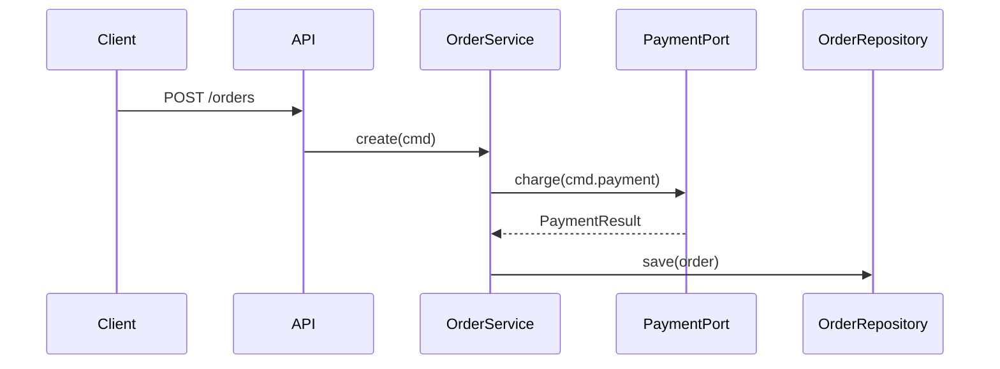

# SDD Design — Extended Reference

> This file contains verbose worked examples, testing patterns, edge cases, anti-patterns, and quick reference externalized from `SKILL.md` to keep the main skill under 5KB. See [SKILL.md](../../../.agents/skills/sdd-design/SKILL.md) for the core design protocol.

---

## Actionable Examples (use as templates)

### 5.1 Design Document Template

```markdown
# Design: {Change Title}

## Context
{Link to proposal, exploration. One paragraph: why this design.}

## Architecture Decision
**Chosen**: {e.g., Hexagonal with ports-and-adapters}
**Alternatives considered**: {Clean, Modular monolith, Event-driven} — why rejected
**Dependency rule**: {e.g., domain → ports → adapters; no reverse}

## Module Map
| Module | Responsibility | Public API | Depends On |
|---|---|---|---|
| `domain/order` | Core order logic | `OrderService`, `OrderRepository` | — |
| `ports/payment` | Payment abstraction | `PaymentPort` | `domain/order` |
| `adapters/stripe` | Stripe implementation | `StripeAdapter` | `ports/payment` |

## Data Flow (Happy Path)


## Data Migration (if applicable)
| Phase | Strategy | Rollback |
|---|---|---|
| 1. Expand | Add new columns, dual-write | Drop columns |
| 2. Migrate | Backfill historical data | Revert backfill |
| 3. Contract | Remove old columns | Restore from backup |

## API Surface
| Endpoint | Method | Request | Response | Errors |
|---|---|---|---|---|
| `/orders` | POST | `CreateOrderReq` | `OrderRes` | 400, 402, 500 |

## Security Boundaries
- Trust boundary: `API` → `Domain` (validated DTOs only)
- Auth: JWT on API; domain receives `UserContext` (no tokens)
- Secrets: Stripe key in adapter only; never in domain

## Open Questions / Risks
- {Risk}: {Likelihood} — {Mitigation}
```

### 5.2 Architecture Decision Record (ADR) Template

```markdown
# ADR-{NNN}: {Title}

**Status**: {Proposed | Accepted | Superseded}
**Date**: {YYYY-MM-DD}
**Context**: {What forces us to decide?}
**Decision**: {What we chose}
**Consequences**:
- Positive: {benefits}
- Negative: {tradeoffs, costs}
- Neutral: {follow-up work}
**Alternatives**: {A: ..., B: ...} — why rejected
**Links**: proposal, design, related ADRs
```

### 5.3 Layering Pattern — Ports & Adapters (Hexagonal)

```text
src/
├── domain/           # Pure business logic, zero deps
│   ├── order.ts
│   └── ports/        # Interfaces (outbound)
│       └── PaymentPort.ts
├── application/      # Use cases, orchestrates domain
│   └── CreateOrderUseCase.ts
├── adapters/         # Implement ports (inbound/outbound)
│   ├── http/         # Inbound: Express/Fastify controllers
│   └── stripe/       # Outbound: StripePaymentAdapter.ts
└── config/           # Wiring: DI container, env
```

**Rule**: Domain imports nothing external. Adapters import domain. Application imports domain + ports.

### 5.4 API Design — Versioned, Typed, Documented

```typescript
// contracts/orders/v1/create-order.ts
export interface CreateOrderRequest {
  customerId: CustomerId;        // Branded type
  items: ReadonlyArray<OrderItem>;
  payment: PaymentMethod;        // Discriminated union
  idempotencyKey: IdempotencyKey;
}

export interface CreateOrderResponse {
  orderId: OrderId;
  status: 'created' | 'payment_pending';
  expiresAt: ISO8601;
}

export type CreateOrderError =
  | { code: 'VALIDATION_ERROR'; details: ValidationError[] }
  | { code: 'PAYMENT_DECLINED'; reason: string }
  | { code: 'IDEMPOTENCY_CONFLICT'; existingOrderId: OrderId };
```

### 5.5 Data Migration — Expand/Contract Pattern

```sql
-- Phase 1: Expand (backward compatible)
ALTER TABLE orders ADD COLUMN payment_intent_id VARCHAR(255);
CREATE INDEX idx_orders_payment_intent ON orders(payment_intent_id);

-- Phase 2: Migrate (dual-write in code, backfill script)
UPDATE orders SET payment_intent_id = pi.id
FROM payment_intents pi WHERE pi.order_id = orders.id;

-- Phase 3: Contract (after verification)
ALTER TABLE orders DROP COLUMN legacy_payment_ref;
```

---

## Testing Patterns (3)

### Pattern 1: Design Completeness Check
```bash
# Verify design doc has all 7 required sections
grep -E "## Architecture Decision|## Module Map|## Data Flow|## Data Migration|## API Surface|## Security Boundaries|## Open Questions" design.md
# Must return 7 matches minimum
```

### Pattern 2: Dependency Rule Validation
```bash
# Verify no reverse dependencies (domain → adapters forbidden)
# In code: domain/ must not import from adapters/ or application/
grep -r "from.*adapters" src/domain/ && echo "VIOLATION: domain imports adapters"
grep -r "import.*adapters" src/domain/ && echo "VIOLATION: domain imports adapters"
```

### Pattern 3: API Schema Validation
```bash
# Verify TypeScript interfaces compile and match OpenAPI spec
npx tsc --noEmit contracts/
# Or validate against OpenAPI
npx @redocly/openapi-cli lint openapi.yaml
```

---

## Edge Cases (4)

### Edge Case 1: No Schema Changes (Pure Logic Change)
**Scenario**: Change only adds business logic, no DB/API changes.
**Handling**: Data Design section states "No schema changes required". Data Migration = N/A. API Surface = N/A or "No new endpoints".

### Edge Case 2: Breaking API Change Required
**Scenario**: Must remove/rename endpoint field (breaking change).
**Handling**: API Design documents version bump strategy. Migration plan includes deprecation timeline. ADR records tradeoff.

### Edge Case 3: Cross-Context Data Sharing
**Scenario**: Two bounded contexts need shared data.
**Handling**: Document shared kernel or anti-corruption layer. Security Boundaries must show trust boundary explicitly.

### Edge Case 4: Legacy Code Without Tests (Testing Strategy)
**Scenario**: Design affects untested legacy module.
**Handling**: Testing Strategy requires characterization tests FIRST. Risk factor 5 (non-testable code) gets explicit mitigation.

---

## Anti-Patterns (5)

### Anti-Pattern 1: Design Without Alternatives
```
❌ Only documents chosen approach
✅ Must list 2+ alternatives with rejection reasons
Rationale: ADR without alternatives = unexamined decision
```

### Anti-Pattern 2: Vague Module Boundaries
```
❌ "Module does X and Y"
✅ Module Map: explicit responsibility, public API, dependencies
Rationale: Unclear boundaries → coupling → maintenance debt
```

### Anti-Pattern 3: Missing Rollback in Migration
```
❌ Data Migration has no rollback column
✅ Every phase has rollback strategy
Rationale: Migration without rollback = production incident waiting to happen
```

### Anti-Pattern 4: Security as Afterthought
```
❌ Security Boundaries section empty or generic
✅ Explicit trust boundaries, auth flow, secrets location
Rationale: Security design must drive architecture, not decorate it
```

### Anti-Pattern 5: Testing Strategy = "Write Tests"
```
❌ "Add unit tests for new code"
✅ Risk-based: map 7 risk factors to specific test approaches
Rationale: Generic testing misses critical paths; risk-based targets coverage where it matters
```

---

## Quick Reference

| Design Section | Required | Key Output |
|---|---|---|
| Architecture Decision | ✅ | Chosen + alternatives + dependency rule |
| Module Map | ✅ | Table with responsibility, API, deps |
| Data Flow | ✅ | Sequence diagram (mermaid) |
| Data Migration | If applicable | 3-phase expand/contract table |
| API Surface | If applicable | Endpoint table with types/errors |
| Security Boundaries | ✅ | Trust boundaries, auth, secrets |
| Testing Strategy | ✅ | Risk factor → test approach mapping |
| Open Questions | ✅ | Risks with likelihood + mitigation |

**Artifacts to persist**: `design.md` + `ADR-{NNN}.md` (if new decision) → `sdd/{change}/` + Engram via `mem_save`

## Externalized Sections (ADR-007 compression)
## Input Artifacts (load in parallel)

- `sdd/{change-name}/proposal` — the approved change proposal
- `sdd/{change-name}/exploration` — (optional) exploration artifacts if a discovery phase ran
- Project standards from orchestrator (if injected)
